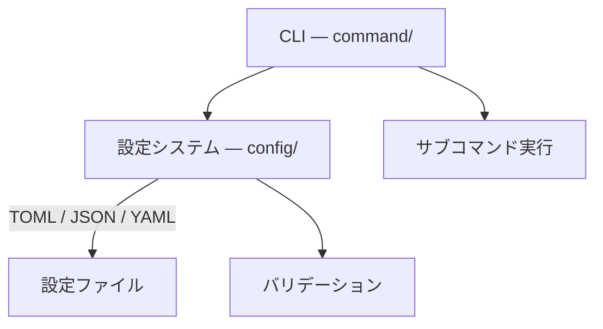

# C++ CLI Template

C++17 CLI アプリケーションのテンプレートプロジェクト。
CLI11 を使ったサブコマンド構成と、TOML / JSON / YAML 対応の設定システムを備える。
pixi による再現性の高い開発環境と、カバレッジ計測・コード品質ツールを提供する。

> **FetchContent でライブラリとして取り込む場合は [README-library.md](README-library.md) を参照してください。**

## 必要条件

- [pixi](https://prefix.dev/)
- Linux では、`valgrind` が必要な場合はシステムパッケージから別途インストールする（後述）

### pixi のインストール

```bash
# Linux / macOS
curl -fsSL https://pixi.sh/install.sh | bash
# インストール後にシェルを再起動するか、以下を実行する
source ~/.bashrc   # bash の場合
source ~/.zshrc    # zsh の場合
```

pixi をインストール後、以下のコマンドで環境をセットアップする。

```bash
pixi install          # ビルド・テスト用（default 環境）
pixi install -e dev   # 開発者用（静的解析・カバレッジ等を追加）
```

## クイックスタート

```bash
pixi run config   # CMake 設定（Release）
pixi run build    # ビルド
pixi run test     # テスト実行

# アプリ実行例
./build/cmd add 10 20
./build/cmd --config config/example.toml subtract 15 5
```

## 対応プラットフォーム

| プラットフォーム              | コンパイラ         | リンカ             | サポート状況 |
| ----------------------------- | ------------------ | ------------------ | ------------ |
| Linux x86-64                  | GCC 15 / Clang 21  | mold（高速リンク） | メイン       |
| macOS (Apple Silicon / Intel) | AppleClang         | system             | 補助的       |
| Windows                       | —                  | —                  | 未サポート   |

> **注意**: pixi.toml に win-64 のクロスコンパイラ定義が含まれるが、Windows は正式サポート対象外。

## 導入ライブラリ

### アプリケーション

| ライブラリ    | バージョン | 用途                          |
| ------------- | ---------- | ----------------------------- |
| CLI11         | 2.6.2      | コマンドライン引数解析        |
| fmt           | 12.2.0     | 文字列フォーマット            |
| toml++        | 3.4.0      | TOML 設定ファイル解析         |
| nlohmann/json | 3.12.0     | JSON / JSONC 設定ファイル解析 |
| yyjson        | 0.12.0     | 高速 JSON 読み書き            |
| fkYAML        | 0.4.3      | YAML 設定ファイル解析         |
| tl::expected  | 1.3.1      | expected 型バックポート（C++11 以上、C++23 で std::expected に切り替え） |
| tcb::span     | HEAD       | span 型バックポート（C++11 以上、C++20 で std::span に切り替え）         |

### テスト・ベンチマーク

| ライブラリ | バージョン | 用途                 |
| ---------- | ---------- | -------------------- |
| doctest    | 2.5.3      | テストフレームワーク |
| nanobench  | 4.3.11     | マイクロベンチマーク |

## 主要タスク一覧

```bash
# ---- 通常ワークフロー ----
pixi run config           # CMake 設定（Release）
pixi run config-debug     # CMake 設定（Debug）
pixi run build            # ビルド
pixi run test             # テスト実行
pixi run clean            # ビルド成果物をクリーン（全ビルドディレクトリ対象）

# ---- コード品質（dev 環境が必要: pixi install -e dev） ----
pixi run -e dev format           # clang-format によるコード整形
pixi run -e dev lint             # clang-tidy による静的解析
pixi run -e dev run-cppcheck     # cppcheck による静的解析
pixi run -e dev fullcheck        # typos + lint + cppcheck をまとめて実行

# ---- サニタイザ（ASan + UBSan）: Linux のみ、dev 環境が必要 ----
pixi run -e dev asan             # 設定 → ビルド → テストをまとめて実行（build-asan/）

# ---- カバレッジ（dev 環境が必要） ----
pixi run -e dev coverage         # 設定 → 計測 → HTML レポート生成（build-coverage/）

# ---- valgrind: Linux のみ、要システムインストール ----
pixi run valgrind         # 全テストを valgrind（memcheck）で実行（dev 環境不要）
```

### 並列ビルドジョブ数

`cmake --build` は `-j` 未指定の場合、デフォルトで 1 並列で動作する（Ninja などのビルドツールがデフォルト並列数を決定するわけではなく、CMake が明示的に並列数を渡さない）。
ジョブ数を明示したい場合は環境変数 `CMAKE_BUILD_PARALLEL_LEVEL` を設定するか、`-j` オプションを直接渡す。

```bash
# 環境変数で指定（セッション全体に適用）
export CMAKE_BUILD_PARALLEL_LEVEL=8
pixi run build

# -j を追加して一時的に指定
cmake --build build -j 4
```

詳細なビルドシステムの説明は [docs/build-system.md](docs/build-system.md) を参照。

### valgrind（Linux のみ）

pixi 環境の valgrind はシステムの動的リンカ（`/lib64/ld-linux-x86-64.so.2`）と互換性がないため、システム側のパッケージを使用する。

```bash
# Ubuntu / Debian
sudo apt-get install valgrind

# インストール後に実行
pixi run valgrind
```

## 設定システム

CLI 引数・設定ファイル・デフォルト値を統合管理する。

**優先度**: CLI 引数 > 後方の設定ファイル > 前方の設定ファイル > デフォルト値

`--config`（`-c`）は複数回指定可能で、後に指定したファイルが前のファイルを上書きする。
`.conf` 拡張子のファイルはマニフェスト（ファイルリスト）として展開される。

> **注意**: `plugins` などの複合型フィールドは設定ファイル専用であり、CLI からの指定には対応しない。

対応フォーマット:

| 拡張子           | 形式       | 備考                                    |
| ---------------- | ---------- | --------------------------------------- |
| `.toml`          | TOML       |                                         |
| `.json`          | JSONC      | `//` コメント対応                       |
| `.yaml` / `.yml` | YAML       |                                         |
| `.conf`          | マニフェスト | 1行1パス、`#` コメント対応             |

```bash
# 設定ファイルを指定して実行
./build/cmd --config config/example.toml add 10 20

# 複数ファイルを指定（後勝ちマージ）
./build/cmd -c config/base.toml -c config/override.toml add 10 20

# マニフェストで組み合わせを定義
./build/cmd -c config/experiment.conf add 10 20

# CLI 引数で設定値を上書き（最優先）
./build/cmd -c config/example.toml --settings.value=99 add 10 20
```

`--config` を省略した場合、`config/default.{toml,json,yaml}` を自動探索する（複数存在はエラー）。

詳細は [docs/config-system.md](docs/config-system.md) および [docs/config-system-guide.md](docs/config-system-guide.md) を参照。

## アーキテクチャ概要



## ディレクトリ構成

- `src/` — アプリケーションソースコード
    - `command/` — CLI エントリポイント・サブコマンド
    - `config/` — 設定ファイルの読み込み・管理（内部実装ヘッダを含む）
- `include/` — 公開ヘッダファイル
    - `command/` — CLI インターフェース（カスタマイズ対象）
    - `config/` — 設定システム（カスタマイズ対象）
    - `cliconf/` — 汎用ライブラリ層（変更不要）
        - `utility/` — yyjson ラッパー（JsonBuilder）
- `tests/` — テストコード（doctest）
    - `support/` — テスト用ユーティリティ（SpyLogger, TempFile, doctest サンプル）
- `benches/` — ベンチマーク（nanobench）
- `config/` — 設定ファイルサンプル（TOML / JSON / YAML）
- `output/` — 実行時出力ファイル（git 追跡対象外）
- `cmake/` — CMake モジュール群
- `docs/` — ドキュメント

## テンプレートのカスタマイズ

このテンプレートは以下の 2 層に分かれています。

**変更不要（汎用ライブラリ層）**:

- `include/cliconf/` — utility（yyjson ラッパー）・compat（expected / span）

**変更対象（CLIテンプレート層）**:

- `include/config/` / `src/config/` — 設定スキーマ・フィールド追加
- `include/command/` / `src/command/` — CLI コマンド・サブコマンド実装

サブコマンド名やフィールド名は `src/command/subcommand.cpp` に集約されており、
追加・変更の際はこのファイルのみを修正します。

## ドキュメント

- [README-library.md](README-library.md) — FetchContent でライブラリとして取り込む場合の手引き
- [docs/build-system.md](docs/build-system.md) — ビルドシステム・開発ツールの詳細
- [docs/config-system.md](docs/config-system.md) — 設定システムの設計概要
- [docs/config-system-guide.md](docs/config-system-guide.md) — 設定システムの利用ガイド（フィールド追加・設定ファイル書き方）
- [docs/config-system-internals.md](docs/config-system-internals.md) — 設定システムの実装解説（FieldDescriptor・std::apply 等）
- [docs/config-system-porting.md](docs/config-system-porting.md) — FetchContent 取り込み後のセットアップ手順
